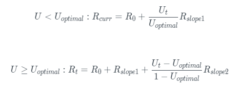

# Model Suku Bunga

Suku bunga terbagi atas dua jenis yaitu: suku bunga borrower dan suku bunga supplier. suku bunga borrower dibebankan kepada peminjam aset, serta suku bunga supplier diberikan kepada pemberi pinjaman.

* ketika U < Uoptimal  maka, suku bunga borrower akan meningkat perlahan bersama tingkat pemanfaatannya.
* Ketika U ≥ Uoptimal  maka, suku bunga pinjaman akan meningkat drastis untuk meningkatkan jumlah simpanan yang tersedia dan menghindari resiko likuiditasi.
